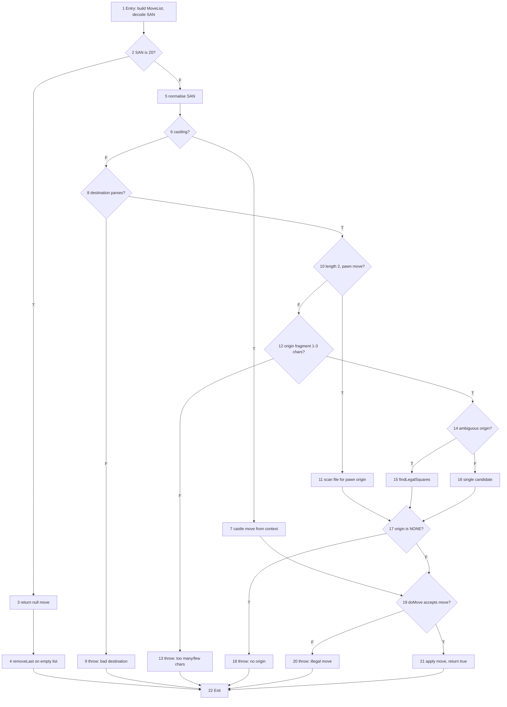

# Progress from Graph-Based Testing — `Board.doMove(String san)`

**Tester:** Supanut Chindawan
**Software under test:** chesslib v1.3.7

> Structured to match Section 2 of the Group 8 Progress Report so both graph-based
> subsections read consistently in the final report.

---

## Selected Component

```java
public boolean doMove(final String move) {
    MoveList moves = new MoveList(this.getFen());
    moves.addSanMove(move, true, true);
    return doMove(moves.removeLast(), true);
}
```

The method executes a move given in **Short Algebraic Notation (SAN)** such as `e4`, `Nf3`
or `O-O`. The three lines above contain no branching of their own: all the interesting
control flow lives in `MoveList.decodeSan(Board, String, Side)`, which the call delegates to.
The component under test is therefore `doMove(String)` **together with the SAN decoding it
performs**, in the same way `isDraw()` was modelled together with the four predicates it calls.

It was selected because SAN parsing is genuinely branch-heavy — castling, promotion, pawn
moves, piece moves, and ambiguity resolution each take a different route through the code —
and because it is the entry point most users of the library reach for first.

## Documented Contract

The Javadoc states:

> Executes a move on the board, specified in Short Algebraic Notation (SAN). It returns
> `true` if the operation has been successful and the position changed after the move.
>
> `@return true` if the move was successful and the resulting position is valid

No exception is documented, and the sibling overload `doMove(Move, boolean)` returns `false`
rather than throwing when a move cannot be played. Expected results below are derived from
this contract: **a SAN string that cannot be executed should produce `false`, not an
exception.**

## Graph Model

The CFG for `doMove(String)` contains 22 nodes.

| Node | Description |
|---|---|
| 1 | Entry — build a `MoveList` from the current FEN and begin decoding the SAN |
| 2 | **D1** — is the SAN the null-move token `Z0`? |
| 3 | Return the null move; the caller adds nothing to the list |
| 4 | `removeLast()` is called on an empty list |
| 5 | Normalise the SAN — strip `+ # ! ? ep` and split off any promotion suffix |
| 6 | **D2** — is the SAN a castling move (`O-O` or `O-O-O`)? |
| 7 | Take the castling move from the board context |
| 8 | **D3** — does the destination square parse? |
| 9 | Throw — "Couldn't parse destination square" |
| 10 | **D4** — is the SAN two characters long, i.e. a plain pawn move? |
| 11 | Pawn path — scan the destination file for the pawn's origin square |
| 12 | **D5** — piece path: is the extracted origin fragment 1 to 3 characters? |
| 13 | Throw — "Too many/few characters" |
| 14 | **D6** — do several pieces of that type reach the destination (ambiguous)? |
| 15 | `findLegalSquares` — take the first candidate that yields a legal move |
| 16 | Single candidate — use it directly |
| 17 | **D7** — is the origin square still `NONE`? |
| 18 | Throw — "Couldn't parse 'from' square" |
| 19 | Build the `Move`; **D8** — does `doMove(move, true)` accept it? |
| 20 | Throw — "Illegal move" |
| 21 | Move applied; replay it on this board and return `true` |
| 22 | Exit |

**Edges (29 total):**

```
1→2
2→3   (T: Z0)                 2→5   (F: ordinary SAN)
3→4
4→22
5→6
6→7   (T: castling)           6→8   (F: not castling)
7→19
8→9   (F: bad destination)    8→10  (T: destination parsed)
9→22
10→11 (T: pawn move)          10→12 (F: piece move)
11→17
12→13 (F: bad length)         12→14 (T: length acceptable)
13→22
14→15 (T: ambiguous)          14→16 (F: unique)
15→17
16→17
17→18 (T: origin is NONE)     17→19 (F: origin found)
18→22
19→20 (F: move rejected)      19→21 (T: move accepted)
20→22
21→22
```

### Diagram



## Coverage Criteria: Edge Coverage

Edge Coverage was selected for the same reasons it was chosen for `isDraw()`, which keeps the
two graph-based subsections of the final report consistent. It forces both outcomes of every
decision to be exercised, which matters here because each false branch is a distinct error
path that would otherwise never be reached. The graph contains no loops, so every edge is
reachable with a small test set: **all 29 edges are covered by 9 test cases.**

## Test Cases (Edge Coverage)

| Test # | Route being exercised | Starting position (FEN) | SAN | Expected | Edges covered |
|---|---|---|---|---|---|
| M1 | Ordinary piece move, unique origin | starting position | `Nf3` | `true` | 1→2, 2→5, 5→6, 6→8, 8→10, 10→12, 12→14, 14→16, 16→17, 17→19, 19→21, 21→22 |
| M2 | Pawn move path | starting position | `e4` | `true` | 10→11, 11→17 |
| M3 | Castling path | `r3k2r/8/8/8/8/8/8/R3K2R w KQkq - 0 1` | `O-O` | `true` | 6→7, 7→19 |
| M4 | Null-move token | starting position | `Z0` | `false` — nothing to execute | 2→3, 3→4, 4→22 |
| M5 | Destination square does not exist | starting position | `e9` | `false` | 8→9, 9→22 |
| M6 | Origin fragment too long | starting position | `Nabcd3` | `false` | 12→13, 13→22 |
| M7 | Ambiguous origin, resolved by legality | `4k3/8/8/8/8/5N2/8/1N2K3 w - - 0 1` | `Nd2` | `true` | 14→15, 15→17 |
| M8 | No piece of that type can reach the square | `4k3/8/8/8/8/8/8/4K3 w - - 0 1` | `Ne5` | `false` | 17→18, 18→22 |
| M9 | Well-formed SAN, move rejected by validation | `7b/8/8/8/8/8/1B6/K7 w - - 0 1` | `Ba3` | `false` | 19→20, 20→22 |
| M10 | Extra — pawn advancing three squares | starting position | `e5` | `false` | (no new edges; see note) |

M7 uses a position with White knights on b1 and f3, both of which attack d2, so the SAN
`Nd2` is genuinely ambiguous and forces the disambiguation branch. Under the PGN standard
this SAN is invalid: a move that two identical pieces could make must be disambiguated as
`Nbd2` or `Nfd2`. The expected result is therefore rejection.

M9 uses a pinned bishop: White's king on a1 and bishop on b2 are on the same diagonal as
Black's bishop on h8, so moving the bishop to a3 would leave the king in check. The SAN
decodes to a unique origin square and is only rejected at the final validation step, which is
what makes it the test for the 19→20 branch.

M10 covers no new edge. It was added after the first execution round, when the SAN `e5`
turned out to be *accepted* from the starting position — a pawn advancing three squares in a
single move. It is retained as a separate observation about the strength of the validation
that `doMove` performs.

## Test Execution Results

All 10 test cases were executed using JUnit 5 against chesslib v1.3.7. All 29 edges of the
CFG were covered, so Edge Coverage was achieved.

| Result | Count |
|---|---|
| Passed | 4 |
| Failed | 6 |

### Observed Behaviour

| Test # | Expected | Actual | Verdict |
|---|---|---|---|
| M1 | `true` | `true`; knight played to f3 | Pass |
| M2 | `true` | `true`; pawn to e4 and the en passant target set to e3 | Pass |
| M3 | `true` | `true`; king and rook both moved, castling rights cleared | Pass |
| M4 | `false` | `IndexOutOfBoundsException: Index: -1, Size: 0` | **Fail — D-09** |
| M5 | `false` | `MoveConversionException: Couldn't parse destination square[e9]` | **Fail — D-08** |
| M6 | `false` | `MoveConversionException: ... Too many/few characters` | **Fail — D-08** |
| M7 | Rejected as ambiguous | `true`; the knight on b1 was chosen and the knight on f3 left alone | **Fail — D-10** |
| M8 | `false` | `MoveConversionException: Couldn't parse 'from' square Ne5` | **Fail — D-08** |
| M9 | `false` | `MoveConversionException: ... Illegal move: b2a3 [Ba3]` | **Fail — D-08** |
| M10 | `true` (documented) | `true`; the pawn advanced from e2 to e5 in one move | Pass — see O-01 |

## Defects Identified

Numbering continues from the input-domain work on `loadFromFen`, which produced D-01 to D-07.

| ID | Tests | Description | Severity |
|---|---|---|---|
| D-08 | M5, M6, M8, M9 | Every SAN string that cannot be executed produces a `MoveConversionException` rather than the documented `false`. The exception is unchecked and appears in no `@throws` clause, so nothing warns a caller to catch it, and the sibling overload `doMove(Move, boolean)` returns `false` in exactly these situations. A caller who follows the Javadoc and writes `if (!board.doMove(san))` gets a crash instead of a branch. | Medium |
| D-09 | M4 | `doMove("Z0")` fails with `IndexOutOfBoundsException: Index: -1, Size: 0`. `Z0` is chesslib's own null-move token: `decodeSan` recognises it and returns early without adding a move, then `doMove(String)` calls `removeLast()` on the now-empty list. The library crashes on a token it defines itself, and the failure surfaces as a raw collection error with no chess-related message. | **High** |
| D-10 | M7 | An ambiguous SAN is accepted instead of rejected. With White knights on b1 and f3, both able to reach d2, the PGN standard requires `Nbd2` or `Nfd2`; chesslib accepts bare `Nd2` and plays the b1 knight, chosen only because it has the lower square index. Replaying a game that contains an ambiguous SAN therefore produces a different game, silently. | Medium |

### Observation O-01 — validation is weaker than the method name suggests

M10 shows `doMove("e5")` succeeding from the starting position: the pawn advances from e2 to
e5, three squares in a single move. This is **not counted as a defect**, because the Javadoc
states it plainly:

> the method does not check whether the move is legal or not according to the standard chess
> rules, but rather if the resulting configuration is valid. For instance, it is totally fine
> to move the king by two or more squares, or a rook beyond its friendly pieces

It is recorded here because the gap between the documentation and a reasonable reading of the
API is wide. A method called `doMove`, invoked with `fullValidation` set to `true`, that
accepts a three-square pawn advance will surprise most callers, and the caveat sits several
paragraphs into the Javadoc. This belongs in Section 8 as a documentation and API-design
recommendation rather than as a defect report.

### Note on Continuous Integration

As with the `loadFromFen` suite, the six failing tests are tagged `known-defect` and excluded
from the default `mvn test` run. Execute them with:

```bash
mvn test -Dexcluded.test.groups=
```
